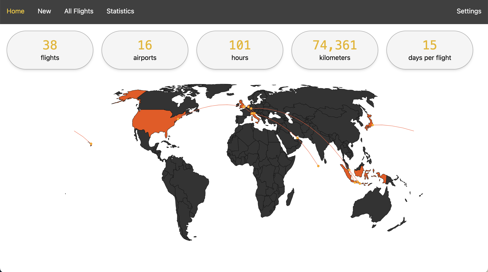

# jetlog

<p align="center">
    
    
</p>

A self-hostable personal flight tracker and viewer

|
:--------------------------------------:|:---------------------------------------------:

## Features

- 🌍 World map view of all visited airports and trajectories of flights
- 📊 Statistics for all your flights
- 📱 (semi-)Responsive design
- 👨‍💻 Sleek and intuitive UI
- ✅ Effortlessly add, edit, and delete past flights

## Installation

### Docker (recommended)

Use the sample `docker-compose.yml` from the repo or make your own. Make sure to add a volume from your data path to `/data`, and remember that the application in the container runs on port `3000`.

**Note**: Please make sure that the volume you are binding to the container has appropriate ownership, otherwise it won't start.

**Non-stable releases**: You can pull the image with the `:experimental` tag to gain access to the latest features which have not been thoroughly tested yet.

### Manual (development)

1. Clone the repository and `cd` to it
2. Install npm dependencies and build frontend
    ```
    npm ci
    npm run build
    ```
3. Install pipfile dependencies with pipenv
    ```
    pip install pipenv
    pipenv install
    ```
4. Open the virtual shell and start the server
    ```
    pipenv shell
    (jetlog) python -m uvicorn main:app --app-dir server --host 0.0.0.0 --port 3000
    ```
5. All done, you can open `http://localhost:3000` on your browser to view jetlog

### Configuration

| Name        | Default | Function            |
|-------------|---------|---------------------|
| PGID        | 1000    | Group ID for JetLog |
| PUID        | 1000    | User ID for JetLog  |
| JETLOG_PORT | 3000    | HTTP Port           |

## API documentation

You can make use of the automatically generated docs (thanks to FastAPI) by
going to `http://<your-ip>:<your-port>/docs`.

## Stack

- [FastAPI](https://fastapi.tiangolo.com/)
- [SQLite](https://www.sqlite.org/)
- [React](https://react.dev/)
- [TailwindCSS](https://tailwindcss.com/)

## Other credits

- [Airports database](https://github.com/jpatokal/openflights/)
- [react-simple-map](https://www.react-simple-maps.io/)
- [World GeoJSON](https://geojson-maps.kyd.au/)
