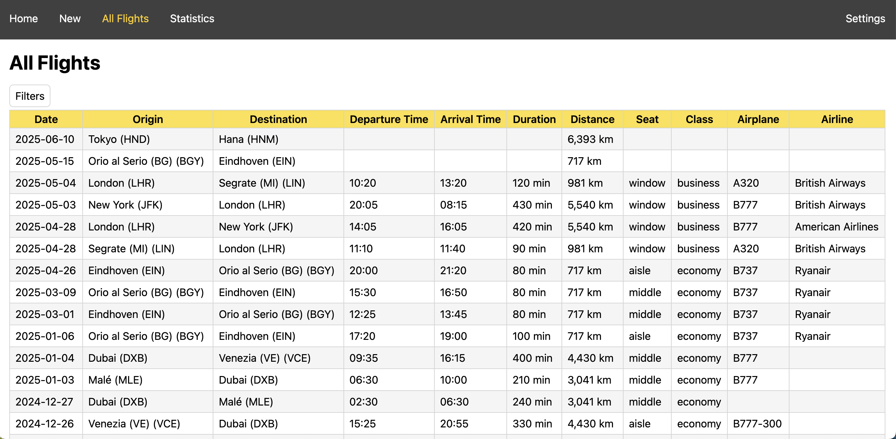

# jetlog

<p align="center">
    
    
</p>

A self-hostable personal flight tracker and viewer

|
:--------------------------------------:|:---------------------------------------------:

## Index
- [Features](#features)
- [Installation](#installation)
  - [Docker](#docker-recommended)
  - [Manual](#manual-development)
- [Importing](#importing)
  - [MyFlightRadar24](#myflightradar24)
  - [Custom](#custom-csv)
- [API](#api-documentation)
- [Stack](#stack)
- [Other credits](#other-credits)

## Features

- 🌍 World map view of all visited airports and trajectories of flights
- 📊 Statistics for all your flights
- 📱 Responsive design
- 👨‍💻 Sleek and intuitive UI
- ✅ Effortlessly add, edit, and delete past flights
- 💾 Ability to import from CSV, MyFlightRadar24
- 💾 Ability to export to CSV, iCal

## Installation

### Docker (recommended)

Use the sample `docker-compose.yml` from the repo or make your own. 
Make sure to add a volume from your data path to `/data`, and remember that the application in the container runs on port `3000`.

**Note**: Please make sure that the volume you are binding to the container has appropriate ownership, otherwise it won't start. 
To do this, you can either create the folder to be used as volume before running the container for the first time, or let docker 
create it first and then set its ownership manually by running `sudo chown -R 1000:1000 /path/to/volume/folder` (you can change
`1000:1000` to whatever your user and group IDs are).

**Non-stable releases**: You can pull the image with the `:experimental` tag to gain access to the latest features which have not been thoroughly tested yet.

**Supported platforms**: `linux/amd64`, `linux/arm64`. 

Below are some of the environment variables you can set in the Docker Compose.

| Name          | Default | Function            |
|---------------|---------|---------------------|
| `APP_PATH`    | `/app`  | App path            |
| `DATA_PATH`   | `/data` | Data path           |
| `PGID`        | `1000`  | Group ID for Jetlog |
| `PUID`        | `1000`  | User ID for Jetlog  |
| `JETLOG_PORT` | `3000`  | HTTP Port           |

### Manual (development)

1. Clone the repository and `cd` to it
2. Install npm dependencies and build frontend
    ```
    npm ci
    npm run build
    ```
3. Install pipfile dependencies with pipenv
    ```
    pip install pipenv
    pipenv install
    ```
4. Open the virtual shell and start the server
    ```
    pipenv shell
    (jetlog) python -m uvicorn main:app --app-dir server --host 0.0.0.0 --port 3000
    ```
5. All done, you can open `http://localhost:3000` on your browser to view jetlog

## Importing

The API has a dedicated `/importing` endpoint, which supports the formats described below

### MyFlightRadar24

1. Go to `MyFlightRadar24 > Settings > Export` and download the CSV
2. Go to `Jetlog > Settings > Import`
3. Upload your CSV in the `MyFlightRadar24` section and press `Import`
4. Check your logs for progress

### Custom CSV

This format allows you to create a custom CSV that will be imported.
The CSV should have the following columns (order doesn't matter):

|Column name     |Required|Format|
|----------------|--------|-----------|
|`date`          | `Yes`  |`YYYY-MM-DD`|
|`origin`        | `Yes`  |ICAO code of origin airport (4 letters)|
|`destination`   | `Yes`  |ICAO code of destination airport (4 letters)|
|`departure_time`| `No`   |`HH:MM`|
|`arrival_time`  | `No`   |`HH:MM`|
|`arrival_date`  | `No`   |`YYYY-MM-DD`|
|`seat`          | `No`   |One of `window`,`middle`,`aisle`|
|`duration`      | `No`   |Number of minutes (integer)|
|`distance`      | `No`   |Kilometers (!)|
|`airplane`      | `No`   |String|
|`flight_number` | `No`   |String|
|`notes`         | `No`   |String|

The importing logs should give you information about any errors.

Here's an example custom CSV:
```csv
date,distance,origin,destination,arrival_time,departure_time
2024-03-14,800,lime,eheh,11:20,10:00
2024-03-19,800,eheh,lime,18:40,16:30
```

1. Go to `Jetlog > Settings > Import`
2. Upload your CSV in the `Custom CSV` section and press `Import`
3. Check your logs for progress

## API documentation

You can make use of the automatically generated docs (thanks to FastAPI) by going to `http://<your-ip>:<your-port>/docs`.

## Stack

- [FastAPI](https://fastapi.tiangolo.com/)
- [SQLite](https://www.sqlite.org/)
- [React](https://react.dev/)
- [TailwindCSS](https://tailwindcss.com/)

## Other credits

- [Favicon](https://www.flaticon.com/free-icon/flight_16863550?term=plane&page=1&position=36&origin=search&related_id=16863550)
- [Airports database](https://github.com/jpatokal/openflights/)
- [react-simple-map](https://www.react-simple-maps.io/)
- [World GeoJSON](https://geojson-maps.kyd.au/)
